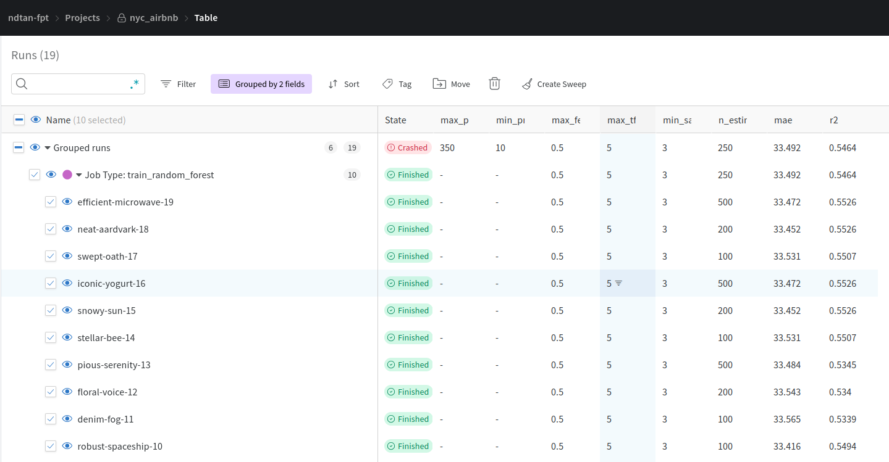

# Build an ML Pipeline for Short-Term Rental Prices in NYC
## Project Description

```
tree .
.
├── components
│   ├── conda.yml
│   ├── get_data
│   │   ├── conda.yml
│   │   ├── data
│   │   │   ├── sample1.csv
│   │   │   └── sample2.csv
│   │   ├── MLproject
│   │   └── run.py
│   ├── README.md
│   ├── setup.py
│   ├── test_regression_model
│   │   ├── conda.yml
│   │   ├── MLproject
│   │   └── run.py
│   ├── train_val_test_split
│   │   ├── conda.yml
│   │   ├── MLproject
│   │   └── run.py
│   └── wandb_utils
│       ├── __init__.py
│       ├── log_artifact.py
│       └── sanitize_path.py
├── conda.yml
├── config.yaml
├── cookie-mlflow-step
│   ├── cookiecutter.json
│   ├── {{cookiecutter.step_name}}
│   │   ├── conda.yml
│   │   ├── {{cookiecutter.script_name}}
│   │   └── MLproject
│   └── README.md
├── environment.yml
├── main.py
├── MLproject
├── README.md
└── src
    ├── basic_cleaning
    │   ├── conda.yml
    │   ├── MLproject
    │   └── run.py
    ├── data_check
    │   ├── conda.yml
    │   ├── conftest.py
    │   ├── MLproject
    │   └── test_data.py
    ├── eda
    │   ├── conda.yml
    │   ├── EDA.ipynb
    │   └── MLproject
    └── train_random_forest
        ├── conda.yml
        ├── feature_engineering.py
        ├── MLproject
        └── run.py

33 directories, 90 files
```
## Install
### 1. Setup enviroment
```
conda env create -f environment.yml
conda activate nyc_airbnb_dev
```

### 2. Login to Wandb
```
wandb login
```

### 3. Cookiectutter
```
pip install cookiecutter

cookiecutter cookiecutter-mlflow-template -o src
step_name [step_name]: basic_cleaning
script_name [run.py]: run.py
job_type [my_step]: basic_cleaning
short_description [My step]: This steps cleans the data
long_description [An example of a step using MLflow and Weights & Biases]: Performs basic cleaning on the data 
parameters [parameter1,parameter2]: parameter1,parameter2
```

### 4. Pandas Profiling
```
pip install ydata-profiling
profile = ProfileReport(df, title="Profiling Report")
profile.to_widgets()
```

### 5. Realease new version
```
git tag -a 1.0.3 -m "Release 1.0.3"
git push origin 1.0.3
```

### 6. Tutorial run step by step
#### 6.1. Run full pipeline
```
mlflow run .
```

#### 6.2. Dowload data
```
mlflow run . -P steps=download

2023-10-19 15:08:24,493 Returning sample sample1.csv
2023-10-19 15:08:24,493 Uploading sample.csv to Weights & Biases
```
#### 6.3. EDA
```
mlflow run src/eda
```

#### 6.4 Basic cleaning
```
mlflow run . -P steps=basic_cleaning

2023-10-19 15:11:06,089 Dropping duplicates
2023-10-19 15:11:06,107 Dropping outliers
2023-10-19 15:11:06,107 Number rows before dropping outliers: 20000
2023-10-19 15:11:06,116 Number rows after dropping outliers: 19001
2023-10-19 15:11:06,116 Converting last_review to datetime
2023-10-19 15:11:06,121 Saving cleaned dataframe to csv
2023-10-19 15:11:06,214 Logging artifact
```


#### 6.5 Check data
```
mlflow run . -P steps=check_data

cachedir: .pytest_cache
rootdir: /home/tari/Documents/Udacity/ml_devops/projects/project2/NYC/src/data_check
collected 6 items                                                                                                                                                                                                          

test_data.py::test_column_names PASSED                                                                       [ 16%]
test_data.py::test_neighborhood_names PASSED                                                                 [ 33%]
test_data.py::test_proper_boundaries PASSED                                                                  [ 50%]
test_data.py::test_similar_neigh_distrib PASSED                                                              [ 66%]
test_data.py::test_price_range PASSED                                                                        [ 83%]
test_data.py::test_row_count PASSED                                                                          [ 100%]
```

#### 6.6 Split data
```
mlflow run . -P steps=data_split

2023-10-19 15:04:42,150 Fetching artifact clean_sample.csv:latest
2023-10-19 15:04:53,936 Splitting trainval and test
2023-10-19 15:04:53,952 Uploading trainval_data.csv dataset
2023-10-19 15:05:36,198 Uploading test_data.csv dataset
```

#### 6.7 Training model with random forest
```
mlflow run . -P steps=train_random_forest

2023-10-19 15:26:16,278 Minimum price: 10, Maximum price: 350
2023-10-19 15:26:16,288 Preparing sklearn pipeline
2023-10-19 15:26:16,289 Fitting
2023-10-19 15:26:36,704 Scoring
2023-10-19 15:26:36,783 Score: 0.5493514908717645
2023-10-19 15:26:36,784 MAE: 33.41601480263158
2023-10-19 15:26:36,784 Exporting model
```

#### 6.8 Optimizer hyper parameters
```
mlflow run . \
    -P steps=train_random_forest \
    -P hydra_options="modeling.random_forest.max_depth=10,50,100 modeling.random_forest.n_estimators=100,200,500 -m"

```


#### 6.9. Test model
```
mlflow run . -P steps=test_regression_model

2023-10-19 16:01:33,506 Loading model and performing inference on test set
2023-10-19 16:01:33,711 Scoring
2023-10-19 16:01:33,815 Score: 0.5667662213851652
2023-10-19 16:01:33,815 MAE: 33.15299473822678
```